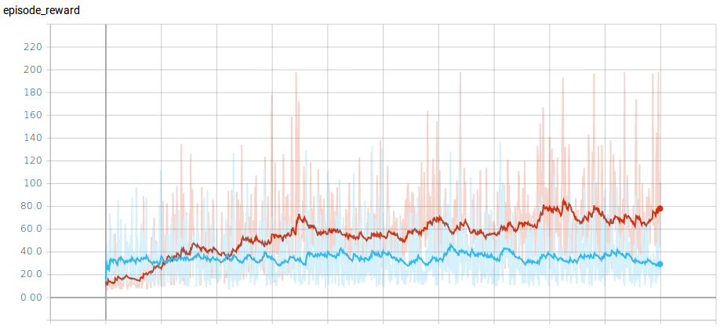

# gail-tf-gym
**TensorFlow** implementation of **Generatve Adversarial Imitation Learning (GAIL)** and **Behavioural Cloning (BC)** for classic **cartpole-v0** environment from OpenAI Gym. (based on <a href="https://arxiv.org/abs/1606.03476"><b>Generative Adversarial Imitation Learning,</b></a> Jonathan Ho & Stefano Ermon.)

## Dependencies
- python: 3.5.2
- <a href="https://www.tensorflow.org/">TensorFlow: 1.1.0 [with GPU]</a>
- <a href="https://github.com/openai/gym">gym: 0.9.3 </a>

## Gym environment 
- CartPole-v0  
- State: Continuous 
- Action: Discrete 

## Implementation of GAIL:

### Step: 1 Generate expert trajectory data  
Reinforcement Learning algorithm: PPO, is used for generating the expert trajectory data for the CartPole-v0 environment.
```
python3 run_ppo.py
```
<p align= "center">
  
</p>

### Step: 2 Sample the expert trajectory data from the PPO generated trajectories. 
```
python3 sample_trajectory.py
```
### Step: 3.1 Execute Imitation Learning - GAIL.  
```
python3 run_gail.py  
```
<p align= "center">
  
</p>

### Step: 3.2 Run Behavioral Cloning  
```
python3 run_behavior_clone.py 
```
### Step: 4 Test trained policy for GAIL
```
python3 test_policy.py
```
<p align= "center">
  
</p>


## Plots:
|   |  |  
| :---: | :---: |  
| <b> Training and Testing results for GAIL </b> | 

### Note: If you want to test bc policy, specify the _number_ of model.ckpt-_number_ in the directory trained_models/bc  
For example to test behavioral cloning:  
```
python3 test_policy.py --alg=bc --model=1000
```

### Reference:
- <a href="https://arxiv.org/abs/1606.03476"><b>Generative Adversarial Imitation Learning,</b></a> Jonathan Ho & Stefano Ermon.
- <a href="https://blog.openai.com/openai-baselines-ppo/"><b>Proximal Policy Optimization by OpenAI.</b></a> 
- <b><a href="https://github.com/uidilr/gail_ppo_tf">GAIL with PPO implementation using tensorflow</a></b> 
- <b><a href="https://github.com/andrewliao11/gail-tf">GAIL with TRPO & PPO using tensorflow</a></b> 
 
