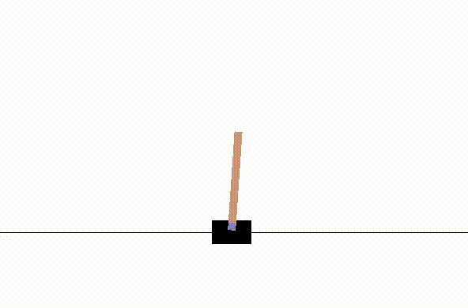

# Generative Adversarial Imitation Learning for gym environments
## gail-ppo-tf-gym
This repository provides a **TensorFlow** implementation of **Generatve Adversarial Imitation Learning (GAIL)** and **Behavioural Cloning (BC)** for classic **cartpole-v0** environment from OpenAI Gym. (based on <a href="https://arxiv.org/abs/1606.03476"><b>Generative Adversarial Imitation Learning,</b></a> Jonathan Ho & Stefano Ermon.)

## Dependencies
- <b>python: 3.5.2</b>
- <b><a href="https://www.tensorflow.org/">TensorFlow: 1.1.0 </a></b>
- <b><a href="https://github.com/openai/gym">gym: 0.9.3 </a></b>

## Gym environment
- <b>CartPole-v0</b>  
- State: <b>Continuous</b>
- Action: <b>Discrete</b>

## Implementation of GAIL:

### Step: 1 Generate expert trajectory data  
Reinforcement Learning algorithm: <b>PPO</b>, is used for generating the <b>expert trajectory</b> data for the CartPole-v0 environment.
```
python3 run_ppo.py
```
<p align= "center">
  
</p>

### Step: 2 Sample the expert trajectory data from the PPO generated trajectories.
```
python3 sample_trajectory.py
```
### Step: 3.1 Execute Imitation Learning - GAIL.  
```
python3 run_gail.py  
```
<p align= "center">
  
</p>

### Step: 3.2 To run behavioral cloning  
```
python3 run_behavior_clone.py
```
### Step: 4 Test trained policy for GAIL
```
python3 test_policy.py
```
<p align= "center">
  
</p>


## Tensorboard Plots:
|   |  |  
| :---: | :---: |  
| <b> Training and Testing results for GAIL </b> |

### Note: If you want to test bc policy, specify the _number_ of model.ckpt-_number_ in the directory trained_models/bc  
For example to test <b>behavioral cloning</b>:  
```
python3 test_policy.py --alg=bc --model=1000
```
## gail-ppo-pytorch-gym

This repository provides a **Pytorch** implementation of **Generatve Adversarial Imitation Learning (GAIL)**  for **bipedwalker-v2** environment from OpenAI Gym. 

## Gym environment
- <b>Bipedwalker-v2</b>  
- <b>State space (Continuous):</b> (1) hull angle, (2) angular velocity, (3) horizontal speed, (4) vertical speed, (5) position of joints (6) joints angular speed, (7) legs contact with ground, and (8) lidar rangefinder measurements

- <b>Action:</b> joint motor torques

### PPO generated expert trajectories:
<p align= "left">
  
  
</p> 

### Imitation learning based on GAIL

<p align= "left">
  
  
</p> 


### Sources:
- <a href="https://arxiv.org/abs/1606.03476"><b>Generative Adversarial Imitation Learning,</b></a> Jonathan Ho & Stefano Ermon.
- <a href="https://blog.openai.com/openai-baselines-ppo/"><b>Proximal Policy Optimization by OpenAI.</b></a>
- <b><a href="https://github.com/uidilr/gail_ppo_tf">GAIL with PPO implementation using tensorflow</a></b>
- <b><a href="https://github.com/andrewliao11/gail-tf">GAIL with TRPO & PPO using tensorflow</a></b>
